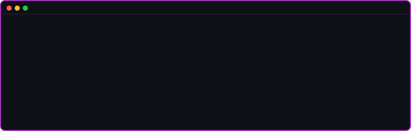
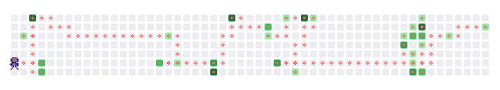

<!-- ══════════════════════════════════════════════════════════════════ -->
<!--  DIVYAM KATARIA • katsdivi • GitHub Profile README               -->
<!-- ══════════════════════════════════════════════════════════════════ -->

<!-- ─── 1. CYBERPUNK BANNER ───────────────────────────────────────── -->

  

<!-- ─── 2. TYPING HEADER ────────────────────────────────────────────── -->

 

<!-- ─── 3. ANIMATED TERMINAL INTRO ─────────────────────────────────── -->
<!-- Commit terminal_about.svg + terminal_skills.svg to your repo root -->

  

 

  

 

---

## ⭐ Projects

  

&nbsp;&nbsp;

  

&nbsp;&nbsp;

  

---

## 🛠️ Languages and Tools

---

## 📊 GitHub Activity

---

<!-- ─── CONNECT WITH ME ─────────────────────────────────────────────── -->

## 🌐 Connect with Me

*Discover my work and connect on these platforms!*

| LinkedIn | Website | Email |
|:---:|:---:|:---:|
|  |  |  |
| **LinkedIn** | **Portfolio** | **Email** |
| [@divyamkataria](https://www.linkedin.com/in/divyamkataria) | [divyamkataria.me](https://divyamkataria.me) | [divyam1211@yahoo.com](mailto:divyam1211@yahoo.com) |

| GitHub | ASU Email | ASU Fulton |
|:---:|:---:|:---:|
|  |  |  |
| **GitHub** | **ASU Email** | **Fulton Engineering** |
| [/katsdivi](https://github.com/katsdivi) | [dkatari2@asu.edu](mailto:dkatari2@asu.edu) | [CS @ ASU](https://engineering.asu.edu) |

---

## 😈 Contribution Demon

<picture>
  <source media="(prefers-color-scheme: dark)"  srcset="demon-dark.svg" />
  <source media="(prefers-color-scheme: light)" srcset="demon.svg" />
  
</picture>

<!-- demon.svg / demon-dark.svg are committed generated assets, refreshed daily
     by .github/workflows/demon.yml. Regenerate locally: node scripts/generate-demon.mjs -->

<!-- ─── FOOTER ────────────────────────────────────────────────────── -->

  

